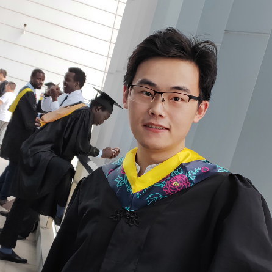

# Zhengcong Fei(费政聪)

  
  
candidate master  

Institute of Computing Technology, Chinese Academy of Sciences  

No.6 Zhongguancun South Road, Beijing, China, 100190  

Email: [feizhengcong@ict.ac.cn](mailto:feizhengcong@ict.ac.cn)  

know more about me: [zhihu](https://www.zhihu.com/people/mai-zi-31-63/activities) [github](https://github.com/feizc)  
 

## Biography

2019.9-Now, M.D. Candidate, Computer Application Technology, ict.  

2018.4-2018.10, research intern, Peking University.

2015.9-2019.6, Bachelor of Electronic information engineering, NJUST; GPA: 3.75/4 (rank: 1/165).  

## Research Interest

machine learning, information retrieval

## Awards

Year | Award | Category
-----|-------|--------
2018 | Meritorious Winner  | MCM/ICM
2018 | First Prize | China Undergraduate Mathematical Contest in Modeling
2018 | First Prize | MathorCup Mathematical Contest
2017 | First Prize | Certification Cup Mathematical Contest
2017 | Second Prize  | National Military Mathematical Modeling League
2016 | First Prize | Mathematics competition of Chinese College Students
2015 | First Prize | CMC  

## Publications

* Better Understanding Hierarchical Visual Relationship for Image Caption 

 Zhengcong Fei 

 **NeurIPS** 2019 Workshop on New In ML, Vancouver, Canada, 2019 
  
 
【[paper](https://arxiv.org/abs/1912.01881)】  【[code](https://github.com/feizc)】 
 

## Skills

* Familiar with  C++，python

* Know  MATLAB, LaTeX

* CET-6: 551; CET-4: 571

---

Last updated on November 15, 2019

---

