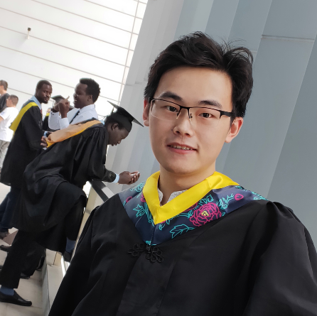

# Zhengcong Fei(费政聪)

Machine Learning Engineer at Meituan Inc, Beijing 

Email: [feizhengcong@gmail.com](mailto:feizhengcong@gmail.com)  

know more about me: [zhihu](https://www.zhihu.com/people/mai-zi-31-63/activities) [github](https://github.com/feizc)   [scholar](https://scholar.google.com/citations?user=_43YnBcAAAAJ&hl=zh-CN) 

## Education 

September, 2019 - June, 2022 | Master's Degree of Computer Application Technology, ICT, UCAS.   
September, 2015 - June, 2019 | Bachelor of Electronic information engineering, NJUST; GPA: 3.75/4 (rank: 1/165). 

## Research Interest

Vision and Language 

## Experience 

December, 2021 - Present | Vision Intelligence Center, Meituan. 
November, 2020 - November, 2021 | Wechat AI, Tencent Inc. 
July, 2020 - October, 2020 | AIEI, Sinovation Ventures.
April, 2018 - October, 2018 | AAIS, Peking University.  

## Competitions 

* Our team ([Zekang Li](https://zekangli.com/), Jinchao Zhang, Yang Feng and Jie Zhou) hold the [DSTC10](https://dstc10.dstc.community/tracks) Track1: Meme incorporated Open-domain Dialogue. 

* Our team ([Zekang Li](https://zekangli.com/), [Xiangru Tang](http://xiangrutang.github.io/), Xiaohao Xu and adviser [Ming Zhou](https://scholar.google.com/citations?user=a0w5c0gAAAAJ&hl=zh-CN&oi=ao)) won the **first place** in the 6-th National Youth artificial intelligence innovation and entrepreneurship Conference, CAAI. 

* Our team ([Zekang Li](https://zekangli.com/), [Xiangru Tang](http://xiangrutang.github.io/), Xiaohao Xu, and Hui Zheng) won the **first place** in the innovation track, Deecamp 2020, Sinovation Ventures. 
   This project is about sci-fic novel generation. 

* Our team ([Zekang Li](https://zekangli.com/), [Xiangru Tang](http://xiangrutang.github.io/), and Xiaohao Xu) won the **first place** in the 2020 artificial intelligence application innovation competition, Huawei Cloud. This project is about AI assisted writing. 

## Publications 

### 2023

* **Zhengcong Fei**, Mingyuan Fan, Junshi Huang. Gradient-Free Textual Inversion. In *technique report*. [[paper](https://arxiv.org/abs/2304.05818)] [[code](https://github.com/feizc/Gradient-Free-Textual-Inversion)]

* **Zhengcong Fei**, Zekang Li, Jinchao Zhang, Yang Feng, Jie Zhou. Overview of the Tenth Dialog System Technology Challenge: DSTC10. In *IEEE/ACM Transactions on Audio, Speech, and Language Processing*. [[paper](https://ieeexplore.ieee.org/stamp/stamp.jsp?arnumber=10174647)] [[code](https://github.com/lizekang/DSTC10-MOD/tree/main)]

* **Zhengcong Fei**, Junshi Huang. Incorporating Unlikely Negative Cues for Distinctive Image Captioning. In *IJCAI2023*. [paper] [code]

* **Zhengcong Fei**, Mingyuan Fan, Li Zhu, Junshi Huang, Xiaoming Wei, Xiaolin Wei. Masked Auto-Encoders Meet Generative Adversarial Networks and Beyond. In *CVPR2023*. [[paper](https://feizc.github.io/resume/ganmae.pdf)] 

* **Zhengcong Fei**, Mingyuan Fan, Li Zhu, Junshi Huang, Xiaoming Wei, Xiaolin Wei. Uncertainty-Aware Image Captioning. In *AAAI2023*. [[paper](https://arxiv.org/abs/2211.16769)] [[code](https://github.com/feizc/UAIC)]

### 2022 

* **Zhengcong Fei**, Junshi Huang, Xiaoming Wei, Xiaolin Wei. Efficient Modeling of Future Context for Image Captioning. In *ACM MM2022*. [[video](https://feizc.github.io/resume/future_journal.pdf)] [[paper](https://feizc.github.io/resume/future.pdf)] [[code](https://github.com/feizc/Future-Caption)] 

* Ji-Xiang He\*, **Zhengcong Fei**\*, Ling Fu, Cai-Ping Tian, Fu-Chu He, Si-Min He, Hao Chi, Jing Yang. pChem: a modification-centric assessment tool for the performance of chemoproteomic probes. In *Nature Chemical Biology*. [[paper](https://www.biorxiv.org/content/biorxiv/early/2021/10/17/2021.09.22.461295.full.pdf)] [[code](https://github.com/pFindStudio/pChem)] [[web](http://pfind.org/software/pChem/index.html)] 

* **Zhengcong Fei**, Xu Yan, Shuhui Wang, Qi Tian. DeeCap: Dynamic Early Exiting for Efficient Image Captioning. In *CVPR2022*. [[paper](https://feizc.github.io/resume/deecap.pdf)] [[code](https://github.com/feizc/DeeCap)] 

* Zhexin Zhang, Yeshuang Zhu, **Zhengcong Fei**, Jinchao Zhang, Jie Zhou. Selecting Stickers in Open-Domain Dialogue through Multitask Learning. In *ACL2022* Findings. [[paper](https://aclanthology.org/2022.findings-acl.241/)] [[code](https://github.com/nonstopfor/Sticker-Selection)]

* **Zhengcong Fei**. Attention-Aligned Transformer for Image Captioning. [[claim](https://github.com/feizc/AAT/tree/main)]

* **Zhengcong Fei**, Zekang Li, Jinchao Zhang, Yang Feng, Jie Zhou. Towards Expressive Communication with Internet Memes: A New Multimodal Conversation Dataset and Benchmark. In DSTC10 track1 organizer. [[paper](https://arxiv.org/abs/2109.01839)] [[code](https://github.com/lizekang/DSTC10-MOD)] [[web](https://openai.weixin.qq.com/dstc/DescriptionEN)] 

### 2021

* Xu Yan\*, **Zhengcong Fei**\*, Zekang Li, Shuhui Wang, Qingming Huang, Qi Tian. Semi-Autoregressive Image Captioning. In *ACM MM2021*. [[paper](https://dl.acm.org/doi/10.1145/3474085.3475179)] [[code](https://github.com/feizc/SAIC)]  [[video](https://dl.acm.org/doi/10.1145/3474085.3475179)]

* Zekang Li, Jinchao Zhang, **Zhengcong Fei**, Yang Feng, Jie Zhou. Conversionsa Are not Flat: Modeling the Dynamic Information Flow between Dialogue Utterances. In *ACL2020*. [[paper](https://aclanthology.org/2021.acl-long.11.pdf)] [[code](https://github.com/ictnlp/DialoFlow)]

* Zekang Li, Jinchao Zhang, **Zhengcong Fei**, Yang Feng, Jie Zhou. Addressing Inquiries about History: An Efficient and Practical Framework for Evaluating Open-domain Chatbot Consistency. In *ACL2021* Findings. [[paper](https://aclanthology.org/2021.findings-acl.91.pdf)] [[code](https://github.com/ictnlp/AIH)]

* **Zhengcong Fei**. Memory-Augumented Image Captioning. In *AAAI2021*. [[paper](https://ojs.aaai.org/index.php/AAAI/article/view/16220)] [[code](https://github.com/feizc/MAIC)] [[video](https://papertalk.org/papertalks/31126)] 

* **Zhengcong Fei**. Partially Non-Autoregressive Image Captioning. In *AAAI2021*. [[paper](https://ojs.aaai.org/index.php/AAAI/article/view/16219)] [[code](https://github.com/feizc/PNAIC/tree/master)] [[video](https://papertalk.org/papertalks/31127)]

* **Zhengcong Fei**. Retrieve and Revise: Improving Peptide Identification with Similar Mass Spectra. In *AAAI2021*. [[paper](https://www.aaai.org/AAAI21Papers/AISI-3105.FeiZ.pdf)]  [[video](https://papertalk.org/papertalks/29612)]

### ~2020

* **Zhengcong Fei**. Iterative Back Modification for Faster Image Captioning. In *ACM MM2020*. [[paper](https://dl.acm.org/doi/abs/10.1145/3394171.3413901)]  [[code](https://github.com/feizc/NAIC)]  [[video](https://dl.acm.org/doi/abs/10.1145/3394171.3413901)]
 
  
* **Zhengcong Fei**. Improving Tandem Mass Spectra Analysis with Hierarchical Learning. In *IJCAI2020*. [[paper](https://www.ijcai.org/Proceedings/2020/0599.pdf)]  [[video](https://www.youtube.com/watch?v=j2e2xiXVla4)]
 

* **Zhengcong Fei**. Actor-Critic Sequence Generation for Relative Difference Captioning. In *ICMR2020*.  [[paper](https://dl.acm.org/doi/pdf/10.1145/3372278.3390679)]   [[video](https://www.loom.com/share/a4ec9e4b53fd47209717e325bd2ed80f)] 

* **Zhengcong Fei**. Novel Peptide Sequencing with Deep Reinforcement Learning. In *ICME2020*. [[paper](https://ieeexplore.ieee.org/document/9102827)] 

  
* **Zhengcong Fei**. Fast Image Caption Generation with Position Alignment. In *AAAI2020* Workshop. [[paper](https://arxiv.org/abs/1912.06365)]  [[code](https://github.com/feizc/NAIC)]  [[PPT](https://aiotworkshop.github.io/2020/program.html)]  
   

* **Zhengcong Fei**. Better Understanding Hierarchical Visual Relationship for Image Caption. In *NeurIPS2019* Workshop. [[paper](https://arxiv.org/abs/1912.01881)]  [[code](https://github.com/feizc/GNN-Pytorch)]  
  

* Wen-Feng Zeng\*, Ching Tarn\*, **Zhengcong Fei**, Si-Min He. pDeep3: Towards More Accurate Spectrum Prediction with Fast Few-Shot Learning. In *Analytical Chemistry*. [[paper](https://www.biorxiv.org/content/10.1101/2020.09.13.295105v1)]  [[code](https://github.com/pFindStudio/pDeep3)]  

* **Zhengcong Fei**, Kaifei Wang, Hao Chi, GameTag: A New Sequence Tag Generation Algorithm Based on Cooperative Game Theory. In *Proteomics*. [[paper](https://onlinelibrary.wiley.com/doi/full/10.1002/pmic.202000021?af=R)]  [[code](https://github.com/feizc/GameTag)] 

## Honors & Awards

-----|-------
2020| China National Scholarship, ICT 
2018| China National Scholarship, NJUST 
2018| Outstanding Student Award, NJUST
2018 | The Mathematical/Interdisciplinary Contest in Modeling, Meritorious Winner
2018 | China Undergraduate Mathematical Contest in Modeling, First Prize 
2018 |  MathorCup Mathematical Contest, First Prize
2017 | Suzhou Industrial Park Scholarship 
2017 |  Certification Cup Mathematical Contest, First Prize
2017 |  National Military Mathematical Modeling League, Second Prize
2016 |  Mathematics competition of Chinese College Students, First Prize
2015 | Chinese Mathematics Competitions, First Prize 

## Skills

* Familiar with  C++，python

* Know  Shell, MATLAB and LaTeX

* CET-6: 551; CET-4: 571
 

## Services

Reviewer: **CVPR**2022; **ICLR**2021; **NeurIPS**2021; **ICCV**2021; **ICML**2021; **CVPR**2021; **IJCAI**2021; **NeurIPS**2020; 

---

Last updated on July 16, 2023

---

